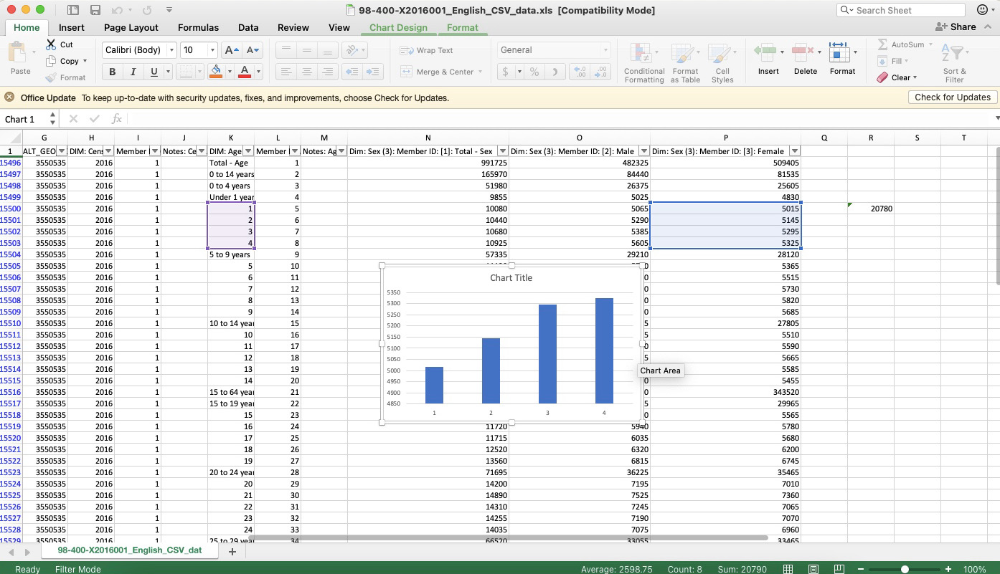
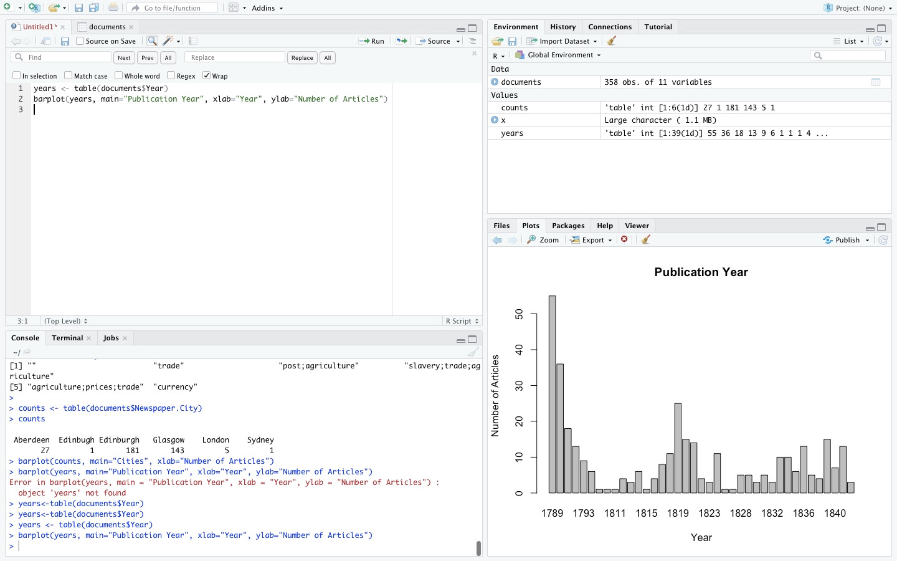
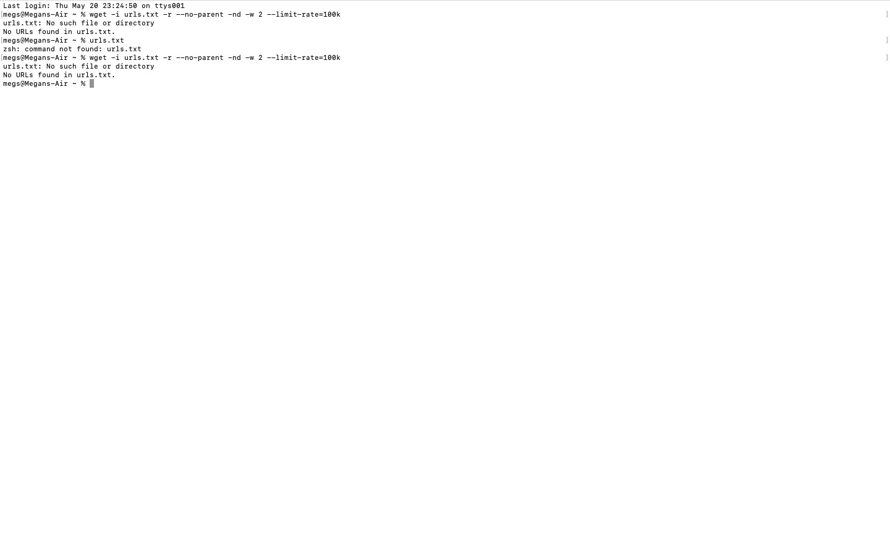
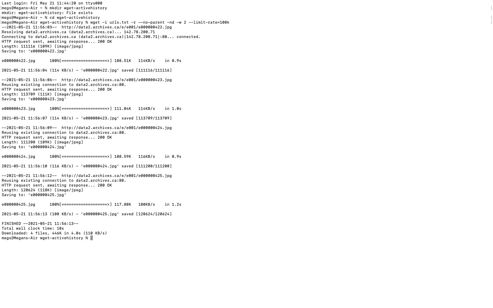
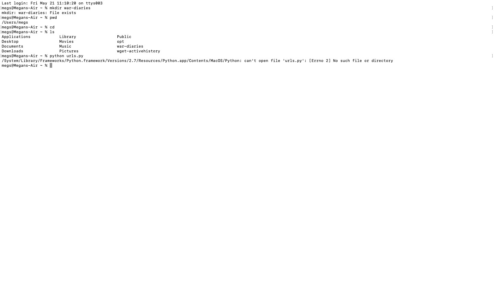
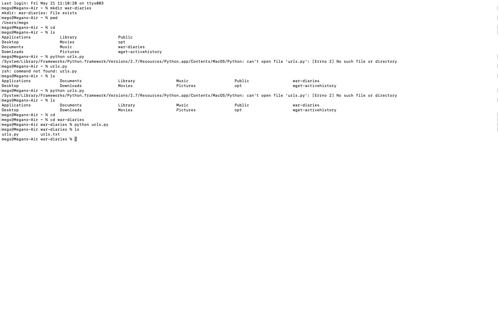

# DIGH 3814: Week 2 Coursework
## Excel
1. As instructed, I downloaded the data from the Canadian 2016 Census.
2. In Excel, I was able to import this csv and it presented a table of data.
3. I refined the data in the table by filtering for the Ontario side of the Ottawa-Gatineau census metropolitan area.
4. I found column D, 'GEO_NAME', clicked on it, unchecked the 'select all' box and then checked the box for the Ontario side of Ottawa-Gatineau.
5. The next step was to write a formula to find the sum of female children ages 1-4, first I had to find where this data began which was in Row 15500.
6.  In Row 15500, I then inserted the given formula which is =sum() and highlighted the 4 cells that held the data for female children ages 1-4.
7. The range, 20780, appeared between the parentheses and I was then able to create a chart after highlighting the two columns.

## Intro to R
1. The first thing I did was download RStudio from the Anaconda Navigator interface.
2. After RStudio installed, I opened R Script.
3. In R Script, I copied the first code, install.packages("RCurl"), and successfully ran it.
4. Then, I copied the second code, library("RCurl"), which also ran without issues.
5. Following instructions, I then copied the code given to access the table of historical data.
6. Then, I copied "x" into the console and the text popped up moments later.
7. In order to see the table, I copied "View(documents)" into the console. At first, I received an error message but I quickly realized it was because I had not capitalized the v in "View".
8. In order to count the number of documents by the city which they were published in, I copied the given codes, counts <- table(documents$Newspaper.City) and counts into RScript and evidently, the counts appeared in the console.
9. I then plotted the counts on a bar graph by copying the given code, barplot(counts, main="Cities", xlab="Number of Articles")
10. As expected, the plot appeared in the bottom right pane of RStudio.
11. Note: I noticed the axis titles of the plot were wrong as the x-axis should read "Cities" (or something along those lines) and the y-axis should read "Number of Articles".
12. Then, I copied the given codes, years <- table(documents$Year)
 and barplot(years, main="Publication Year", xlab="Year", ylab="Number of Articles") to find the number of articles published each year.
 13. As expected, a graph titled "Publication Year" showed up in the bottom right pane.

## Wget
1. First, I installed a tool called "homebrew" by copying the command, /usr/bin/ruby -e "$(curl -fsSL https://raw.githubusercontent.com/Homebrew/install/master/install)", into terminal.
2. I then copied "brew doctor" into the terminal to ensure everything was set up correctly. At first, I kept receiving "command not found", but I quickly realized it was because I was failing to press "return" after copying the link.
3. The next step was to install wget and so I copied "brew install wget" into terminal.
4. Following the instructions, my next step was to test that wget successfully installed and I did this by copying "wget" into terminal.
5. Terminal then responded with the message "missing url" and so I knew wget had been successfully installed.
6. The next step instructed me to create a new directory to work in, I began this process by coping "mkdir wget-activehistory" and "cd wget-activehistory" into terminal.
7. The next step was then to copy "wget http://activehistory.ca/papers/" into terminal and then look around the directory to see what got downloaded.
8. Finally, I was able to copy "wget -r -np -w 2 --limit-rate=20k http://activehistory.ca/papers/" which told wget to follow links which led to destinations in that specific folder.
### Using Wget With a List of urls
1. Following the instructions, I went into my text editor, Sublime text and copied the 4  given urls into it and then saved the file as "urls.txt".
2. Then, I went back into terminal and and copied  "wget -i urls.txt -r --no-parent -nd -w 2 --limit-rate=100k".
3. Note: Initially, terminal told me that there were "no such files in directory" and this puzzled me for a few days.

4. After moving onto the next task, I came back to the issue and realized that I was not saving the "urls.txt" file from Sublime text directly into the "wget-activehistory" directory.
5. After going back to Sublime text and saving the file into the proper directory, I was able to correct the issue in terminal.

### Using Python to Generate a List of urls
1. First, I made a new directory by copying "mkdir war-diaries
".
2. Then, I copied the given script into Sublime text and saved it as "urls.py" in the war-diaries directory.
3. I went back to terminal and typed in "ls" and as expected, the war-diaries folder came up.
4. I followed the instructions by then copying "python urls.py" into the terminal, however, I was told that there was no such file or directory.

5. I went to my dad for help and he informed me that in terminal, I had not yet entered the war-diaries directory.
6. I fixed the issue by typing "ls" into terminal, then "cd war-diaries".
7. Next, I copied "python urls.py" into terminal and after typing "ls" again, "urls.txt" came up.

8. Note: It was at this moment when I realize the mistake I had made in the previous stage while trying to use Wget with a list of urls.
